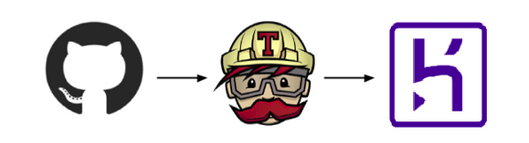

# Product Catalog
[](https://travis-ci.com/RicardoLuizSilveira/des-product-ms)

## What is it?
This is a **Spring Boot Application** that provides a bunch or endpoints to manage a product inventory.


| Verbo HTTP  |  Resource path    |           Descrição           |
|-------------|:-----------------:|------------------------------:|
| POST        |  /products        |   Create a product       |
| PUT         |  /products/{id}   |   Update a product   |
| GET         |  /products/{id}   |   Find a produto by ID  |
| GET         |  /products        |   List all available products           |
| GET         |  /products/search |   Find a specific product |
| DELETE      |  /products/{id}   |   Delete a product       |

For more detailed information about the endpoints check our
<a href="https://des-product-ms.herokuapp.com/swagger-ui/#/product-controller" target="_blank">Online Swagger Documentation</a>

*It is hosted on Heroku please be patient at first access ;-)*

## Well, let's Run!
There are three easy ways to run the application.

### 01 Heroku
If you see this
<a href="https://des-product-ms.herokuapp.com/swagger-ui/#/product-controller" target="_blank">swagger documentation</a> 
it means that the application is already running.
- Just [download our postman collection](#postman)
- Configure the `baseUrl` variable as `https://des-product-ms.herokuapp.com`
- Start your tests 

That's it.

### 02 Docker Image
You can run this app locally, for this purpose we provide a docker image of this app in our
<a href="https://hub.docker.com/r/ricardosilveira/des-product-ms" target="_blank">DockerHub repository</a>,
for more information just go there.

But the easy way is:
```bash
docker pull ricardosilveira/des-product-ms:1.0.0
```
and to run
```bash
docker run -it --rm -p9999:9999 --name ms-product ricardosilveira/des-product-ms:1.0.0
```
then
- Just [download our postman collection](#postman)
- Configure the `baseUrl` variable as `http://localhost:9999`
- Start your tests

*OBS: Swagger documentation in this case available at http://localhost:9999/swagger-ui/*

### 03 Local JAR
the old school people like to run a consistent **jar**, in this case just download the 
package that we prepared from
<a href="https://drive.google.com/drive/folders/15n8VRNMsCDEh2yqdgwZK9dVzlhx3s1Fb?usp=sharing" target="_blank">here</a>.

In this package you have the postman collection, application jar file, and a runnable script. Just look at **readme.txt**.

- Dont't forget to configure the `baseUrl` variable as `http://localhost:9999`

*OBS: Swagger documentation in this case available at http://localhost:9999/swagger-ui/*

## How it is constructed
- Spring Boot Aplication
- Database in memory H2 *(keeping things simple to focus on important things)*
- Git/GitHub as SCM
- CI/CD powered by **TravisCI + Heroku**
- Docker Image manually created *(just for now)*, with Spring Boot itself and pushed to DockerHub. 



## Postman

[Download postman collection](https://github.com/RicardoLuizSilveira/des-product-ms/blob/main/others/ProductAPI.postman_collection.json)

------
## Comming soon
- Sonar Cloud integration
  - bugs
  - test coverage
- Expand tests
- Expand exception treatment
- Performance improvements
- Build and deploy Docker image on DockerHub
